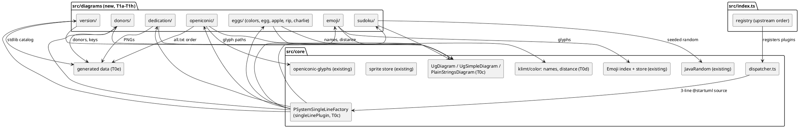

# Component map — utility-factories-port

```plantuml
@startuml
skinparam componentStyle rectangle
package "src/index.ts" as idx {
  [registry (upstream order)] as reg
}
package "src/core" {
  [dispatcher.ts] as disp
  [PSystemSingleLineFactory\n(singleLinePlugin, T0c)] as slf
  [UgDiagram / UgSimpleDiagram /\nPlainStringsDiagram (T0c)] as bases
  [klimt/color: names, distance (T0d)] as col
  [openiconic-glyphs (existing)] as oig
  [Emoji index + store (existing)] as emo
  [sprite store (existing)] as spr
  [JavaRandom (existing)] as jr
}
package "src/diagrams (new, T1a-T1h)" {
  [openiconic/] as oi
  [eggs/ (colors, egg, apple, rip, charlie)] as eggs
  [emoji/] as em
  [sudoku/] as su
  [version/] as ve
  [donors/] as dn
  [dedication/] as de
}
[generated data (T0e)] as data
reg --> disp : registers plugins
disp --> slf : 3-line @startuml source
slf --> oi
slf --> eggs
slf --> em
slf --> su
slf --> ve
slf --> dn
slf --> de
oi --> oig : glyph paths
oi --> data : all.txt order
eggs --> col : names, distance
em --> emo : glyphs
su --> jr : seeded random
dn --> data : donors, keys
de --> data : PNGs
ve --> data : stdlib catalog
oi --> bases
eggs --> bases
em --> bases
su --> bases
ve --> bases
dn --> bases
de --> bases
@enduml
```
