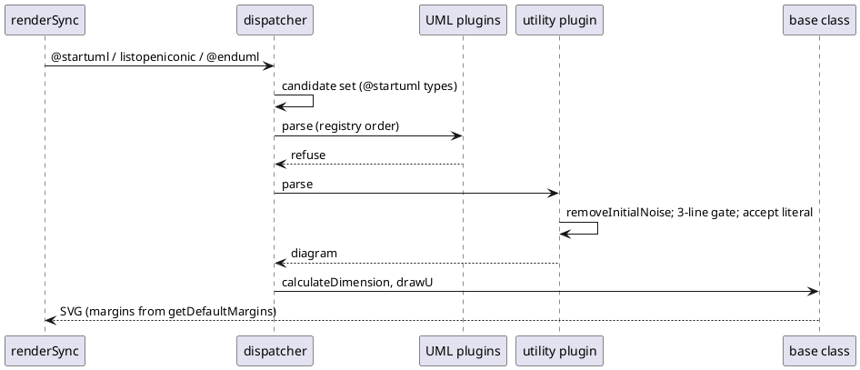

# Data flow — a single-line utility render

```plantuml
@startuml
participant "renderSync" as rs
participant "dispatcher" as d
participant "UML plugins" as uml
participant "utility plugin" as up
participant "base class" as bc
rs -> d : @startuml / listopeniconic / @enduml
d -> d : candidate set (@startuml types)
d -> uml : parse (registry order)
uml --> d : refuse
d -> up : parse
up -> up : removeInitialNoise; 3-line gate; accept literal
up --> d : diagram
d -> bc : calculateDimension, drawU
bc --> rs : SVG (margins from getDefaultMargins)
@enduml
```
