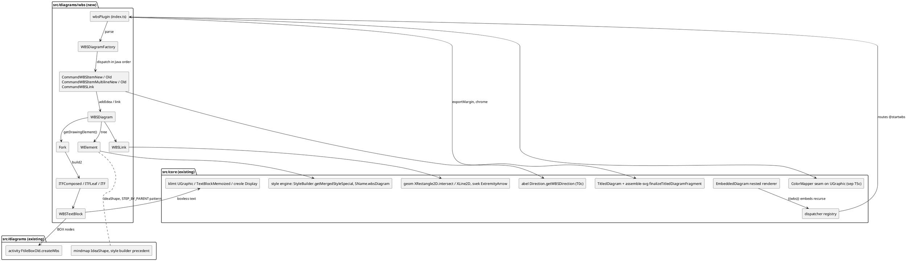

# Component map: wbs-engine-port

What the mission adds (the wbs package) and which existing components it consumes.

```plantuml
@startuml
skinparam componentStyle rectangle
package "src/diagrams/wbs (new)" {
  [WBSDiagramFactory] as F
  [CommandWBSItemNew / Old\nCommandWBSItemMultilineNew / Old\nCommandWBSLink] as CMD
  [WBSDiagram] as D
  [WElement] as W
  [Fork] as FORK
  [ITFComposed / ITFLeaf / ITF] as ITF
  [WBSTextBlock] as TB
  [WBSLink] as LINK
  [wbsPlugin (index.ts)] as PLUG
}
package "src/core (existing)" {
  [dispatcher registry] as REG
  [TitledDiagram + assemble-svg finalizeTitledDiagramFragment] as CHROME
  [klimt UGraphic / TextBlockMemoized / creole Display] as KLIMT
  [style engine: StyleBuilder.getMergedStyleSpecial, SName.wbsDiagram] as STYLE
  [abel Direction.getWBSDirection (T0c)] as DIR
  [geom XRectangle2D.intersect / XLine2D, svek ExtremityArrow] as GEOM
  [ColorMapper seam on UGraphic (sep T5c)] as CM
  [EmbeddedDiagram nested renderer] as EMB
}
package "src/diagrams (existing)" {
  [activity FtileBoxOld.createWbs] as BOX
  [mindmap IdeaShape, style builder precedent] as MM
}
REG --> PLUG : routes @startwbs
PLUG --> F : parse
F --> CMD : dispatch in Java order
CMD --> DIR
CMD --> D : addIdea / link
D --> W : tree
D --> FORK : getDrawingElement()
FORK --> ITF : build2
ITF --> TB
TB --> BOX : BOX nodes
TB --> KLIMT : boxless text
W --> STYLE
D --> LINK
LINK --> GEOM
PLUG --> CHROME : exportMargin, chrome
PLUG --> CM
EMB --> REG : {{wbs}} embeds recurse
MM .. W : IdeaShape, STEP_BY_PARENT pattern
@enduml
```
