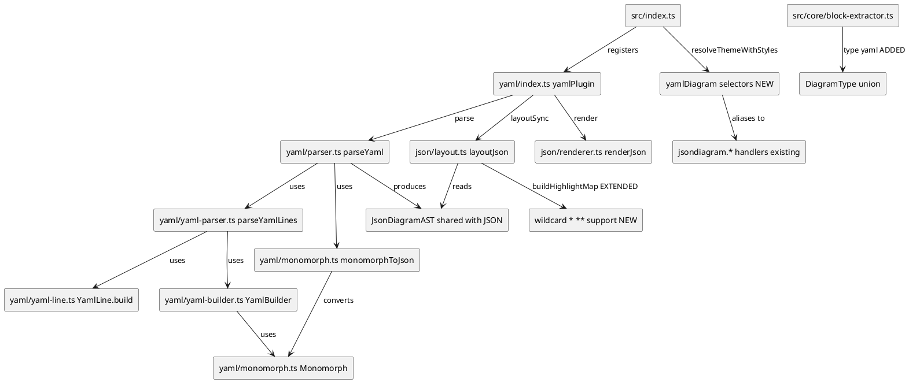

# Component Map

```plantuml
@startuml
skinparam componentStyle rectangle
skinparam shadowing false

[src/index.ts] as A
[yaml/index.ts yamlPlugin] as B
[yamlDiagram selectors NEW] as C
[yaml/parser.ts parseYaml] as D
[json/layout.ts layoutJson] as E
[json/renderer.ts renderJson] as F
[yaml/yaml-parser.ts parseYamlLines] as G
[yaml/monomorph.ts monomorphToJson] as H
[JsonDiagramAST shared with JSON] as I
[yaml/yaml-line.ts YamlLine.build] as J
[yaml/yaml-builder.ts YamlBuilder] as K
[yaml/monomorph.ts Monomorph] as L
[wildcard * ** support NEW] as M
[jsondiagram.* handlers existing] as N
[src/core/block-extractor.ts] as O
[DiagramType union] as P

A --> B : registers
A --> C : resolveThemeWithStyles
B --> D : parse
B --> E : layoutSync
B --> F : render
D --> G : uses
D --> H : uses
D --> I : produces
G --> J : uses
G --> K : uses
K --> L : uses
H --> L : converts
E --> M : buildHighlightMap EXTENDED
E --> I : reads
C --> N : aliases to
O --> P : type yaml ADDED
@enduml
```
