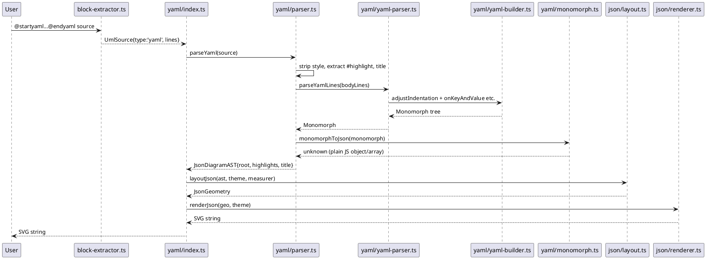

# Data Flow

```plantuml
@startuml
participant User
participant "block-extractor.ts" as BlockExtractor
participant "yaml/index.ts" as YamlPlugin
participant "yaml/parser.ts" as ParseYaml
participant "yaml/yaml-parser.ts" as YamlParser
participant "yaml/yaml-builder.ts" as YamlBuilder
participant "yaml/monomorph.ts" as MonomorphToJson
participant "json/layout.ts" as JsonLayout
participant "json/renderer.ts" as JsonRenderer
User -> BlockExtractor : @startyaml...@endyaml source
BlockExtractor --> YamlPlugin : UmlSource{type:'yaml', lines}
YamlPlugin -> ParseYaml : parseYaml(source)
ParseYaml -> ParseYaml : strip style, extract #highlight, title
ParseYaml -> YamlParser : parseYamlLines(bodyLines)
YamlParser -> YamlBuilder : adjustIndentation + onKeyAndValue etc.
YamlBuilder --> YamlParser : Monomorph tree
YamlParser --> ParseYaml : Monomorph
ParseYaml -> MonomorphToJson : monomorphToJson(monomorph)
MonomorphToJson --> ParseYaml : unknown (plain JS object/array)
ParseYaml --> YamlPlugin : JsonDiagramAST{root, highlights, title}
YamlPlugin -> JsonLayout : layoutJson(ast, theme, measurer)
JsonLayout --> YamlPlugin : JsonGeometry
YamlPlugin -> JsonRenderer : renderJson(geo, theme)
JsonRenderer --> YamlPlugin : SVG string
YamlPlugin --> User : SVG string
@enduml
```
